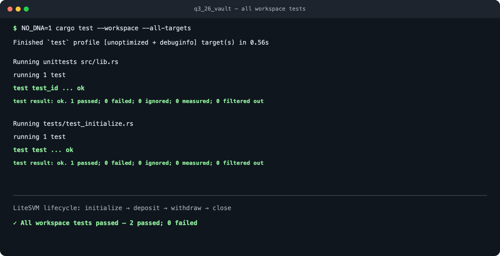

# Q3 2026 Anchor Vault

A per-user SOL vault built with [Anchor](https://www.anchor-lang.com/) for the Turbin3 Q3 2026 assignment. The program lets a user initialize a vault, deposit SOL, withdraw available SOL, and close the vault to recover all remaining lamports.

## How it works

Each user receives two deterministic Program Derived Addresses (PDAs):

- **Vault state PDA** — derived from `[b"state", user]`. It is owned by this program and stores the canonical bumps used to validate both PDAs.
- **Vault PDA** — derived from `[b"vault", user]`. It is a system-owned, zero-data account that holds the user's lamports.

The lifecycle is:

1. **Initialize** creates the vault state PDA, records both bumps, and transfers the vault's rent-exempt minimum from the user.
2. **Deposit** transfers a non-zero amount of lamports from the signing user into their vault.
3. **Withdraw** uses the vault PDA's signer seeds to return a requested amount to the user while preserving the vault's rent-exempt balance.
4. **Close** returns every remaining lamport in the vault—including its rent reserve—and closes the state PDA so its rent is also refunded to the user.

| Instruction | SOL movement | Result |
| --- | --- | --- |
| `initialize` | User → vault PDA | Creates the state PDA and makes the vault rent-exempt |
| `deposit(amount)` | User → vault PDA | Adds SOL to the vault |
| `withdraw(amount)` | Vault PDA → user | Returns SOL but keeps the vault rent-exempt |
| `close` | Vault PDA + state PDA → user | Refunds all remaining SOL and removes the vault state |

## Security model

- Every instruction requires `user: Signer`, so the wallet associated with a vault must authorize its lifecycle actions.
- Both PDAs include the user's public key in their seeds, preventing one user from selecting another user's vault through the program interface.
- Anchor validates the state account's type and ownership, the vault's System Program ownership, both PDA addresses, and the System Program used for transfers.
- Withdrawals reject zero amounts and amounts that would consume the vault's rent reserve. The subtraction used to calculate the withdrawable balance is checked for underflow.
- Transfers out of the vault require `CpiContext::new_with_signer` with the recorded vault bump; the vault has no private key that a person can possess.
- Closing is intentionally terminal: it drains the vault and applies `close = user` to refund the state account's rent.

> This is an educational assignment, not audited production software. The current test covers the successful lifecycle; production use would also require negative tests for unauthorized users, zero-value operations, insufficient funds, repeated initialization, and repeated closure.

## Project structure

```text
programs/q3_26_vault/
├── src/
│   ├── instructions/
│   │   ├── initialize.rs
│   │   ├── deposit.rs
│   │   ├── withdraw.rs
│   │   └── close.rs
│   ├── constants.rs
│   ├── error.rs
│   ├── instructions.rs
│   ├── lib.rs
│   └── state.rs
└── tests/
    └── test_initialize.rs
```

## Setup

### Prerequisites

- Rust `1.89.0` (pinned in `rust-toolchain.toml`)
- Solana CLI
- Anchor CLI compatible with `anchor-lang 1.1.2`

Clone the repository and enter the project directory:

```bash
git clone <repository-url>
cd anchor_vault_starter_q3_26
```

Build the SBF program used by the LiteSVM test:

```bash
anchor build --ignore-keys
```

`--ignore-keys` keeps the assignment's declared program ID unchanged if the locally generated deployment keypair has a different address.

## Testing

Run every Rust test target from the repository root:

```bash
cargo test --workspace --all-targets
```

The test suite runs entirely in-process—no local validator, funded wallet, or network connection is required. It includes Anchor's generated program-ID check and an end-to-end LiteSVM test that verifies:

- creation of the vault state PDA;
- funding of the vault's rent-exempt balance;
- a `500,000,000` lamport deposit;
- a `100,000,000` lamport withdrawal while rent remains intact; and
- closure of the state PDA and complete draining of the vault.

### Passing test result



## Program ID

```text
aNksHVU3gU1mjCPtTBsVk9S7qokAUvXfotB2jBxQQvv
```
